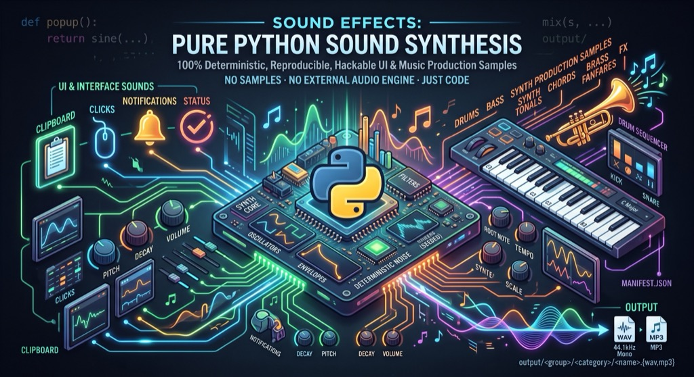

<div align="center">

# 🔊 sound-effects

**Procedurally synthesized UI sound effects *and* music-production samples — generated from scratch in pure Python.**



[](https://www.python.org/)
[](#requirements)
[](synth/core.py)
[](output/)
[](#-categories)
[](#output-layout)
[](#output-layout)
[](#-license)
[](LICENSE)
[](#how-it-works)
[](#requirements)
[](#-adding-your-own-sounds)
[](https://github.com/pepperonas/sound-effects)
[](tests/)
[-informational)](tests/)
[](#-instruments-motif-kits--every-sample-is-a-playable-figure)
[](#-instruments-motif-kits--every-sample-is-a-playable-figure)
[](#-how-it-works)
[](tests/test_synth.py)
[](#-instruments-motif-kits--every-sample-is-a-playable-figure)
[](#output-layout)
[](tests/test_render.py)
[](#-usage)
[](synth/core.py)
[](#-requirements)
[](https://peps.python.org/pep-0008/)

</div>

---

Every sound is built by hand from **sine / square / saw / triangle oscillators**, envelopes
and a deterministic noise source — then mixed into a float buffer and rendered to
**44.1 kHz mono WAV** (plus an MP3 copy). No samples, no numpy, no external audio engine.
Because the noise source is seeded, **builds are bit-for-bit reproducible** on any machine.

```bash
python3 build.py          # → output/<category>/<name>.{wav,mp3} + manifest.json
```

## ✨ Highlights

- 🧰 **398 ready-to-use sounds** across **26 categories** — UI interactions **and** music-production samples
- 🎹 **A whole band and orchestra** — guitar, e-bass, piano, e-piano, brass, strings, choir, flute, harp, mallets, organ, drums, synths and FX, all tuned to musical notes and rooted on C
- 🎺 **Playable motifs, not just one-shots** — riffs, fanfares, arpeggios, glissandi, walking lines and cadences, each a single drag-and-drop sample
- 🔬 **Modelled, not faked** — Karplus-Strong strings, real 2-operator FM for the e-piano, piano string inharmonicity, bar modes for mallets, drawbar additive organ and vocal-tract formants for the choir
- 🐍 **Pure Python standard library** — clone and run, nothing to install
- 🗂️ **Sorted output** — one folder per category + a machine-readable `manifest.json`
- ♻️ **Reproducible** — seeded noise means identical output everywhere
- 🎛️ **Hackable** — every sound is a tiny self-contained function; tweak pitch, length, decay
- 🪶 **Tiny** — the whole synth engine is one ~200-line file with zero dependencies

## 📁 Categories

### 🖥️ UI & interface

| Category | What's in it | Sounds |
|----------|--------------|:------:|
| 📋 **clipboard** | copy, cut & the signature *paste* family | 6 |
| 🖱️ **clicks** | buttons, taps, toggles, switches | 7 |
| 🔔 **notifications** | pings, chimes, message & alert tones | 6 |
| ✅ **status** | success, error, warning, completion | 7 |
| 🪟 **ui** | open, close, hover, swipe, expand, popover | 8 |
| ⚙️ **system** | startup, shutdown, connect, login, power | 8 |
| ⌨️ **typing** | keystrokes, backspace, space, enter | 7 |
| 💬 **messaging** | send, receive, delivered, typing, call tones | 6 |
| ⏯️ **media** | play, pause, stop, skip, volume, record, screenshot | 11 |
| 🎮 **game** | coin, powerup, jump, level-up, achievement, game-over | 10 |

### 🎹 Music production (FL-Studio-style sample kit)

| Category | What's in it | Sounds |
|----------|--------------|:------:|
| 🥁 **drums** | kicks, 808s, snares, claps, hats, toms, cymbals, percs | 17 |
| 🎸 **bass** | 808, sub, reese, saw/square, pluck, wobble, FM — tuned to notes | 8 |
| 🎛️ **synth** | plucks, stabs, leads, keys, bells, organ, pad, arp | 9 |
| 🎵 **chords** | major / minor / 7th / sus / power stabs + pads, rooted on C | 9 |
| 🎺 **brass** | synthetic horn stabs **and 2–5 note fanfare motifs** — duos, calls, riffs | 19 |
| 💥 **fx** | risers, downlifters, impacts, sweeps, reverse cymbal, vinyl | 10 |

### 🎻 Instruments (motif kits — every sample is a playable figure)

| Category | What's in it | Sounds |
|----------|--------------|:------:|
| 🎸 **guitar** | power chords, palm-muted chugs, gallops, riffs, bends, strums | 25 |
| 🎻 **ebass** | fingered, picked & slapped lines, octave pumps, walking bass | 25 |
| 🎹 **piano** | chords, arpeggios, runs, ii-V-I cadences, stride, grace notes | 25 |
| 🎛️ **epiano** | Rhodes/Wurlitzer 7th & 9th chords, comping, licks, tremolo | 25 |
| 🎻 **strings** | section swells, stabs, tremolo, pizzicato, runs, crescendo | 25 |
| 🔔 **mallets** | marimba, vibraphone & glockenspiel — runs, ostinatos, rolls | 25 |
| 🪕 **harp** | glissandi, rolled chords, arpeggios, cascades, bisbigliando | 25 |
| 🎚️ **organ** | drawbar registrations, gospel vamps, stabs, glissandi, pedal | 25 |
| 🎤 **choir** | vowel formants (ah/oo/oh/eh), swells, stabs, chords, cadences | 25 |
| 🪈 **flute** | phrases, trills, mordents, runs, flutter-tongue, grace notes | 25 |

> See the full annotated list any time with `python3 build.py --list`.

### A taste of what's inside

**clipboard** · `paste` · `paste_bubble` · `paste_mechkey` · `paste_scifi` · `copy` · `cut`
**status** · `success` · `success_short` · `error_buzz` · `error_descend` · `warning_pulse` · `complete` · `denied`
**system** · `startup` · `shutdown` · `connect` · `disconnect` · `login` · `logout` · `battery_low` · `usb_plug`
**media** · `play` · `pause` · `stop` · `next_track` · `prev_track` · `volume_up` · `volume_down` · `mute` · `record` · `screenshot`
**game** · `coin` · `powerup` · `jump` · `hurt` · `level_up` · `achievement` · `game_over` · `select` · `laser` · `explosion`
**drums** · `kick` · `kick_808` · `kick_sub` · `snare` · `snare_rim` · `clap` · `hat_closed` · `hat_open` · `tom_low/mid/high` · `crash` · `ride` · `cowbell` · `shaker` · `snap` · `rimshot`
**bass** · `bass_808` · `sub_bass` · `saw_bass` · `square_bass` · `reese` · `pluck_bass` · `wobble_bass` · `fm_bass`
**synth** · `pluck` · `stab` · `lead` · `key` · `bell_tone` · `organ` · `pad` · `arp_blip` · `saw_lead_oct`
**chords** · `major` · `minor` · `maj7` · `min7` · `dom7` · `sus4` · `power` · `major_pad` · `minor_pad`
**brass** · `brass_stab` · `brass_dub_dub` · `brass_da_da` · `brass_duo_up/down` · `brass_octave` · `brass_fanfare_2/3` · `brass_rise_3` · `brass_fall_3` · `brass_call` · `brass_answer` · `brass_triumph` · `brass_riff_4` · `brass_stomp` · `brass_climb_5`
**guitar** · `guitar_power` · `guitar_chug` · `guitar_gallop` · `guitar_riff_min` · `guitar_bend` · `guitar_slide_up` · `guitar_strum_down` · `guitar_arp`
**ebass** · `ebass_octave_2` · `ebass_walk_up` · `ebass_slap_groove` · `ebass_ghost` · `ebass_riff_min` · `ebass_chrom` · `ebass_fill`
**piano** · `piano_maj7` · `piano_arp_up` · `piano_cadence` · `piano_stride` · `piano_grace` · `piano_run_down` · `piano_octaves`
**epiano** · `epiano_min9` · `epiano_bark` · `epiano_comp` · `epiano_wurli` · `epiano_lick` · `epiano_tremolo` · `epiano_cadence`
**strings** · `strings_swell` · `strings_stab_3` · `strings_tremolo` · `strings_pizz_riff` · `strings_marcato` · `strings_crescendo`
**mallets** · `mallets_marimba` · `mallets_vibes` · `mallets_glock` · `mallets_ostinato` · `mallets_roll` · `mallets_thirds`
**harp** · `harp_gliss_up` · `harp_gliss_long` · `harp_roll_maj7` · `harp_cascade` · `harp_arp_wide` · `harp_bisbig`
**organ** · `organ_full` · `organ_jazz` · `organ_leslie` · `organ_shout` · `organ_gliss_up` · `organ_plagal` · `organ_swell`
**choir** · `choir_ah` · `choir_oo` · `choir_swell` · `choir_stab` · `choir_amen` · `choir_cluster` · `choir_vowel_shift`
**flute** · `flute_trill` · `flute_run_up` · `flute_flutter` · `flute_mordent` · `flute_phrase` · `flute_sigh` · `flute_octave`
**fx** · `riser` · `downlifter` · `impact` · `sub_drop` · `sweep_up` · `sweep_down` · `reverse_cymbal` · `white_riser` · `vinyl_crackle` · `laser_zap`

## 🚀 Usage

```bash
python3 build.py                       # build everything (WAV only)
python3 build.py --list                # list every group, category & sound, generate nothing
python3 build.py -g music              # only one use case (interface | music)
python3 build.py -c clicks ui          # build only specific categories
python3 build.py -c drums bass synth   # just part of the music-production kit
python3 build.py -c brass              # just the brass stabs & fanfare motifs
python3 build.py -c guitar ebass piano # build a rhythm section
python3 build.py --mp3                 # also encode an MP3 copy (needs ffmpeg)
```

Preview a sound (macOS `afplay`, Linux `aplay`/`ffplay`):

```bash
afplay output/interface/clipboard/paste.wav
aplay  output/music/drums/kick_808.wav
afplay output/music/brass/brass_fanfare_3.wav
afplay output/music/harp/harp_gliss_up.wav
```

### Output layout

Sounds are split by use case into two top-level groups:

```
output/
├── interface/                 ← computer & UI interaction sounds
│   ├── clipboard/
│   │   ├── paste.wav
│   │   └── …
│   ├── clicks/
│   ├── notifications/
│   ├── status/ ui/ system/ typing/ messaging/ media/ game/
│   └── …
├── music/                     ← FL-Studio-style production samples
│   ├── drums/
│   │   ├── kick_808.wav
│   │   └── …
│   ├── bass/ synth/ chords/ brass/ fx/
│   ├── guitar/ ebass/ piano/ epiano/ strings/
│   ├── mallets/ harp/ organ/ choir/ flute/
│   └── …
└── manifest.json              ← machine-readable index of every sound
```

`manifest.json` is organized by group → category → sound, listing each sound's name,
description, duration and file path — handy for wiring the sounds into an app, a
design system, a sample browser or a sound picker.

## 🧠 How it works

The whole engine lives in [`synth/core.py`](synth/core.py):

- **Oscillators** — `sine`, `square`, `saw`, `triangle`; frequency can be a constant
  *or a function of time* for glides and sweeps.
- **Physical & FM models** — `pluck()` is Karplus-Strong (a noise burst circulating
  in a damped delay line — a real plucked string, and because the line length is
  read per sample it bends and slides); `fm()` is true 2-operator phase modulation,
  which is what an electric piano, a bell and a marimba actually are.
- **Envelopes** — `perc` (percussive decay), `ad`, `adsr`, `bell`.
- **Filters & shaping** — `lowpass`, `highpass` (Hz cutoff, constant or `f(t)`),
  `drive` (soft saturation), `ring_mod`, `reverse`, `noise_burst`, `fade_in/out`, `normalize`.
- **Musical pitch** — `note('C2')` → Hz, `chord('C3', (0, 4, 7))` → frequency list
  and `vibrato(f, rate, depth, onset)` → a pitch that wobbles, so melodic samples
  land on real notes and held ones breathe.
- **Mixing** — `mix(target, src, at=seconds, gain=…)` layers voices into a buffer.
- **Output** — `write_wav()` normalizes, fades the tail and writes 16-bit PCM.

A sound is just a function returning a sample buffer, e.g.:

```python
def popup():
    """Bouncy popover pop."""
    f = lambda t: 600 + 500 * (1 - math.exp(-70 * t))   # quick upward glide
    s = sine(f, 0.16, perc(20))
    mix(s, sine(lambda t: 2 * f(t), 0.16, perc(28)), 0.0, 0.2)
    return s
```

## ➕ Adding your own sounds

1. Open the matching module in [`generators/`](generators/) (or create a new one).
2. A new generator module just needs a few things:

   ```python
   from synth import sine, mix, silence, perc

   CATEGORY = "my_category"
   GROUP = "interface"        # "interface" or "music" — which use case it belongs to
   DESCRIPTION = "What this family of sounds is for."

   def my_sound():
       return sine(880, 0.2, perc(10))

   SOUNDS = [
       ("my_sound", "Short description", my_sound),
   ]
   ```
3. Run `python3 build.py` — it's auto-discovered, sorted into
   `output/<group>/my_category/` and added to the manifest. No registration needed.

## 🗂️ Project structure

```
sound-effects/
├── build.py            # orchestrator: discovers generators, sorts output, writes manifest
├── synth/
│   ├── core.py         # the dependency-free synthesis toolkit
│   └── __init__.py
├── generators/         # one module per sound category (each declares GROUP)
│   ├── clipboard.py     ┐
│   ├── clicks.py        │
│   ├── notifications.py │
│   ├── status.py        │
│   ├── ui.py            │ GROUP = "interface"
│   ├── system.py        │
│   ├── typing.py        │
│   ├── messaging.py     │
│   ├── media.py         │
│   ├── game.py          ┘
│   ├── drums.py         ┐
│   ├── bass.py          │
│   ├── synthtones.py    │ GROUP = "music"  (synthtones → CATEGORY "synth")
│   ├── chords.py        │
│   ├── brass.py         │ GROUP = "music"
│   ├── fx.py            │
│   ├── guitar.py        │
│   ├── ebass.py         │
│   ├── piano.py         │
│   ├── epiano.py        │
│   ├── strings.py       │
│   ├── mallets.py       │
│   ├── harp.py          │
│   ├── organ.py         │
│   ├── choir.py         │
│   ├── flute.py         ┘
│   └── _music.py        # shared: note sequencer, additive summer, glide, stack
                         #   (leading "_" keeps it out of discover())
└── output/             # generated WAVs: output/<group>/<category>/ (+ manifest.json)
```

## 🧩 Requirements

- **Python 3** — standard library only (tested on 3.11–3.14). Builds WAV out of the box.
- **ffmpeg** *(optional)* — only needed for the opt-in `--mp3` flag. Without it,
  `--mp3` falls back to WAV-only automatically.

## 🧪 Tests

```bash
python3 -m unittest discover tests -v      # 108 tests, stdlib only, ~16 s
python3 -m unittest tests.test_synth       # just the engine
```

| Suite | What it pins down |
|-------|-------------------|
| `tests/test_synth.py` | Engine primitives: oscillator spectra, envelope shapes, filter direction, `pluck()` **in tune to ≤ 2 cents across five octaves** and bending correctly, `fm()` sideband structure, vibrato symmetry, WAV format and normalisation |
| `tests/test_music.py` | The shared sequencer: event timing in steps, chord expansion, strum direction, per-note overrides, gain scaling, no leading silence — plus the guard that **ensemble detune stays bounded as voices are added** |
| `tests/test_generators.py` | Every module's contract: `CATEGORY`/`GROUP`/`SOUNDS`, safe folder and file names, globally unique sound names, no dead generator functions, and a manifest that matches what is on disk |
| `tests/test_render.py` | The rendered audio: nothing clips, nothing is silent, no leading gap, every tail ends at zero, and a rebuild is **byte-identical**. Also counts the events behind each sample to check the kits really are motif kits |

Two of these were written after a bug they then caught: `pluck()`'s damping was
non-monotonic (its two-point damper loses `|1-2a|` at Nyquist, so `damp=0.85`
rang *longer* than `damp=0.5`, and every palm mute was doing the opposite of
its job), and the ensemble stack widened with each added voice until six
players sat 31 cents apart.

## 📄 License

[MIT](LICENSE) — free to use, modify and ship in commercial and personal projects.
The sounds are generated by this code, so they're **royalty-free**: use them anywhere.
